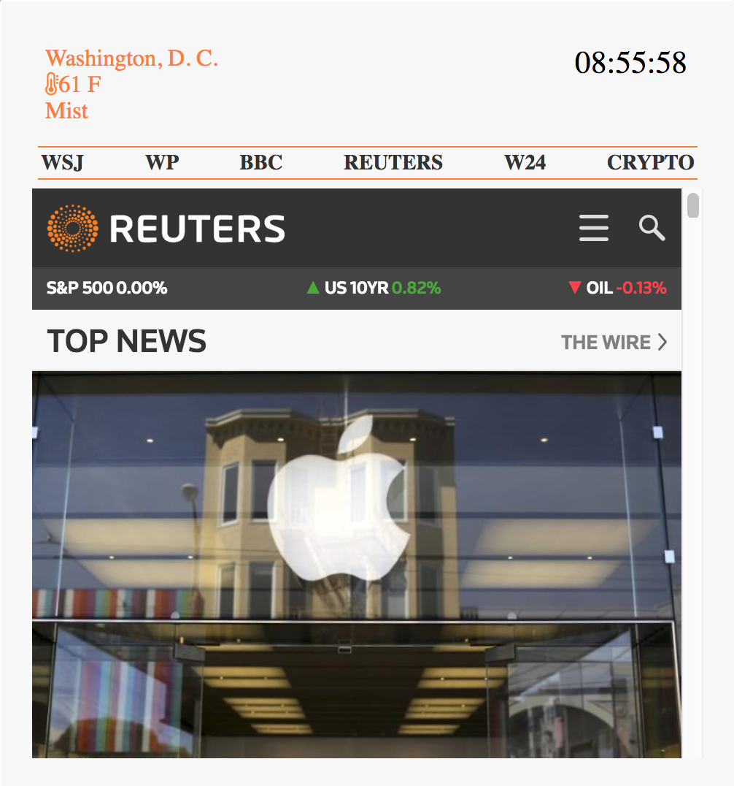

## Summary

Web Dashboard is Chrome browser extension build with React. It allows users to browse several news outlets from the pop-up window without switching tabs or interrupting their work. In addition to it, it provides information about current weather based on user location and shows time. Deployed version can be found at: http://dash-board.surge.sh/#/nyt

## User Stories

A user of this app is browsing the internet with the Chrome browser and does not want to leave current tab or change a content of it, in order to check the latest news. Clicking on extension icon, a pop-up window shows inside current tab. Inside of that window user can choose which of 6 available sources he wants to browse, see weather conditions based on his location, and with the clock at the top is reminded not to squander too much time on it.

## Application Preview

## Technologies Used

Web Dashboard utilizes the React and Node. The app has a React front-end and gets the data from OpenWeatherMap API and third party websites. Dependencies used include:

* axios
* react-router-dom
* React iFrame
* OpenWeatherMap Weather API
* Surge.sh for front-end hosting

## Installation Instructions

Clone the project from the GitHub.
Using CLI go into the web_dashboard folder, run npm install and after that run npm run build .
In Chrome browser open chrome://extensions/
Click on the Developer mode. Inside of web_dashboard project, locate build folder. Drag&drop it inside of Chrome extensions window. An icon will appear in your extensions bar.
